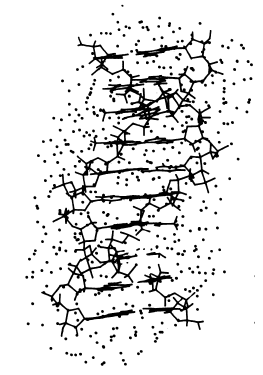
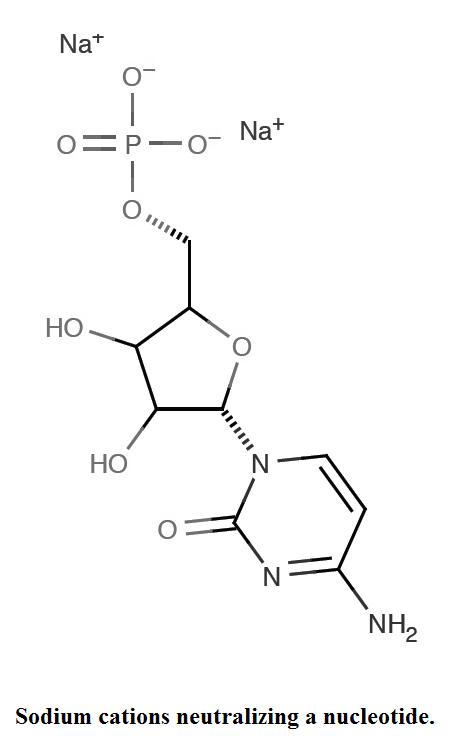
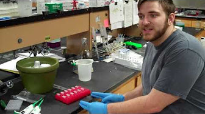

The layer of water just outside of a DNA molecule in solution is called the hydration shell: 

DNA has net negative charge because of its phosphate backbone. Sodium acetate (CH3COONa) which is most widely used salt in ethanol precipitation contains a positively charged metal ion. When salt is added to a solution containing nucleic acids, the salt dissociates to liberate this ion, in this case the cation Na+.

When the cations and negatively charged nucleic acid backbone interact, the charge of the nucleic acid is partially neutralized, therefore no longer dissolve in water and precipitate out of solution.

Ethanol which has lower dielectric constant compared to water increases the interaction of the salt and the Coulomb force of attraction between the cations and the negatively charged nucleic acid backbone (that is, the resistance from the solvent’s electric field sufficiently diminishes to permit efficient interaction; the solvation shells surrounding the solute’s charges depletes).

Ethanol also induces conformational changes to the nucleic acid structure; the repulsive forces between the negatively charged phosphates with a nucleic acid polymer are so diminished that inter-helical interactions are possible, allowing the nucleic acids to aggregate.

## Materials

* 3 M sodium acetate pH 5.2 or 5 M ammonium acetate 
* 100% ethanol
* DNA solution

## Procedure 
Measure the volume of the DNA sample. This can be done with a micropipet. Add carrier if needed (see below). Add the volume of the carrier to the calculations.
 
1. Adjust the salt concentration by adding 1/10 volume of sodium acetate, pH 5.2 (final concentration of 0.3 M) or an equal volume of 5 M ammonium acetate (final concentration of 2.0 to 2.5 M). These amounts assume that the DNA is dissolved in TE or equivalent. If DNA is in a solution containing known ammounts of salt, adjust salt accordingly to achieve the correct final concentration. Mix well.

2. Add 2 to 2.5 volumes of cold 100% ethanol (calculated after salt addition). Mix well by pipetting or vortexing. 
3. Spin a maximum speed in a microfuge for 10–15 min. 
4. Carefully decant supernatant. 
5. Add 1 mL 70% ethanol and mix spin briefly. 
6. Carefully decant supernatant. 
7. Air dry or briefly vacuum dry pellet. 
8. Resuspend pellet in the appropriate volume of TE or water.

### Types of Salts used for Ethanol Precipitation of DNA
* Sodium Acetate
* Ammonium Acetate
* Lithium Chloride
* Sodium Chloride

### Carriers or Co-Precipitants
Carriers or Co-precipitants are substances which improves the nucleic acid target recovery.They are insoluble in ethanol or isopropanol solutions, and they form a precipitate that helps to trap nucleic acids by bulk. During centrifugation, carriers form a visible pellet, which aids in removing the supernatant without perturbing the nucleic acid pellet. Precipitations with carriers from diluted solutions of nucleic acids are also quantitatively more efficient than precipitations without carriers. The carriers are added to the DNA solution before step 1. above.

### List of carriers and their final concentration used in Ethanol Precipitation of DNA
Yeast tRNA - 10–20 μg⁄mL
Salmon Sperm - 10–20 μg⁄mL
Glycogen - 50–150 μg⁄mL
Linear Polyacrilamide - 10–20 μg⁄mL

### Role of Temperature on DNA Precipitation
As the temperature of an alcohol-aqueous solution decreases, its dielectric constant increases. Therefore, in principle, at increasingly chilled temperatures, precipitation efficiency should diminish. Moreover, as the temperature decreases, the viscosity of the solution increases, which retards the movement of the nucleic acid aggregate, especially if the aggregate is small. In addition, since solubility decreases at lower temperatures, more salts will begin to co-precipitate with the nucleic acids at lower temperatures. Therefore, incubation at temperatures below 0°C is counter-productive and not recommended.

### Source

This protocol is based on [this online protocol](http://technologyinscience.blogspot.pt/2014/02/ethanol-precipitation-of-dna-principle.html#.WO3LdMwrKzc)

[Ethanol Precipitation of DNA and RNA: How it works](http://bitesizebio.com/253/the-basics-how-ethanol-precipitation-of-dna-and-rna-works/)

[Zeugin, J.A., Hartley, J.L., 1985. Ethanol precipitation of DNA. Focus 7, 1–2.](http://www.thermofisher.com/content/dam/LifeTech/migration/en/filelibrary/pdf/focus.par.56415.file.dat/focus%20volume%207%20issue%204.pdf)

[Crouse, J., Amorese, D., 1987. Ethanol precipitation: ammonium acetate as an alternative to sodium acetate. Focus 9, 3–5.](http://bio.wayne.edu/profhtml/Cunningham/private/privatedocuments/EtOH.pdf)

[Wikipedia:Ethanol precipitation](https://en.wikipedia.org/wiki/Ethanol_precipitation)

