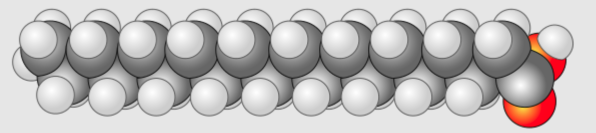
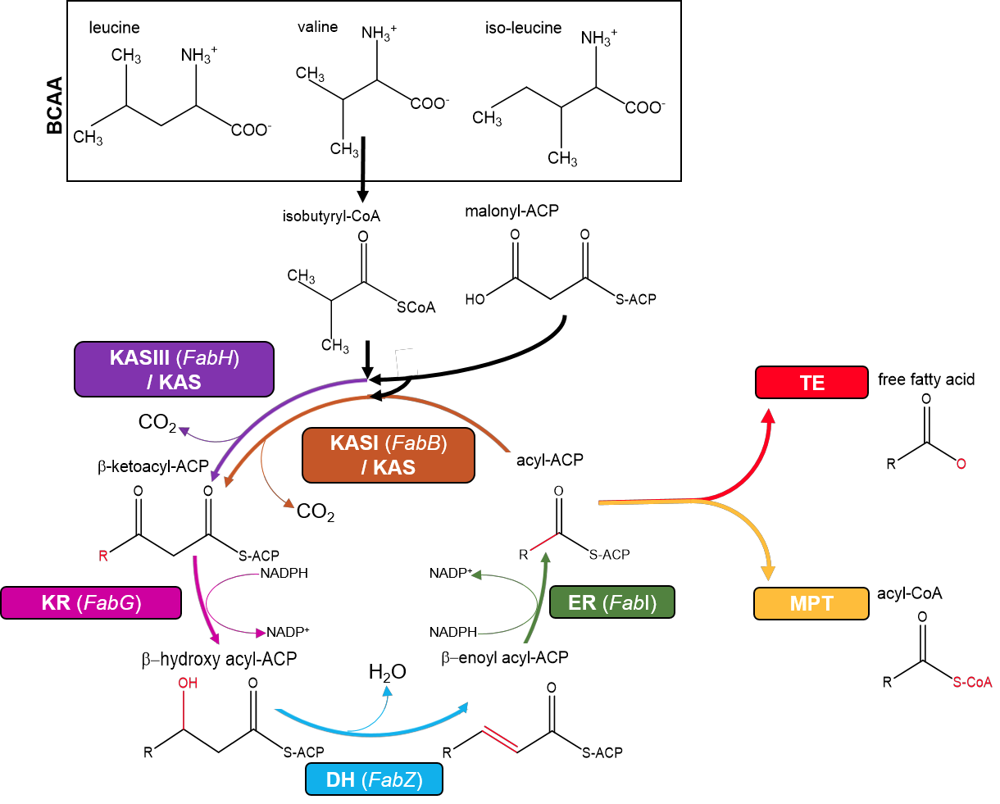
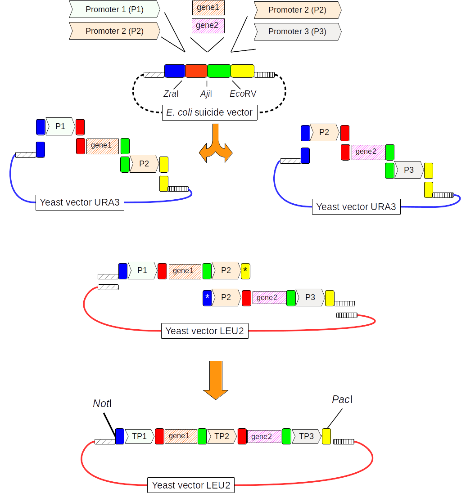

Welcome, We are the MEC research group,
a part of the research center
[Centro de Biologia Molecular e Ambiental (CBMA)](https://www.google.pt/url?sa=t&rct=j&q=&esrc=s&source=web&cd=1&cad=rja&uact=8&ved=0ahUKEwjhgeWevKLLAhUIQBoKHQfcDcAQFggbMAA&url=http%3A%2F%2Fcbma.bio.uminho.pt%2F&usg=AFQjCNERIO6tvOxPHIgk4DaE4Y5LivlEXQ&sig2=8-94NSGguCRjdxnoOm0cYQ&bvm=bv.115339255,d.ZWU).
We are located in the [Department of Biology](https://goo.gl/maps/JyphLrwBYejffwTx5),
[University of Minho](https://www.uminho.pt/EN) in the ancient city of
[Braga](https://en.wikipedia.org/wiki/Braga),
Portugal.

## Our focus

Our interest is metabolic engineering of baker's yeast
[*Saccharomyces cerevisiae*](https://en.wikipedia.org/wiki/Saccharomyces_cerevisiae)
for consumption of new types of substrates and
production of new biotechnologically interesting molecules.
You can see this yeast growing under a microscope in the animated image above.

Specifically, we work on expanding the consumption of for efficient metabolism
of new types of sugars as
[D-xylose](https://en.wikipedia.org/wiki/Xylose) combined with biosynthesis of
[fatty acids](https://en.wikipedia.org/wiki/Fatty_acid) and derived lipids.

This process is important in nature, since fatty acids make up significant
parts of fundamental structures such as cell membranes, but also serve as
efficient energy storage for many cells and organisms.

The process could potentially be used for the green production of fuels
and other chemicals in a future [green economy](https://en.wikipedia.org/wiki/Green_economy).

## Our Tools

As the field of metabolic engineering grow more complex, there is a need for
new tools to solve different aspects of the overall process to increase
throughput and maintain precision.

### Yeast Pathway Kit

We have developed a metabolic pathway assembly method we call
the [**Yeast Pathway Kit**](https://pubmed.ncbi.nlm.nih.gov/26916955), that produces
short metabolic pathways for a given number of genes compared to other methods.
It relies on one library of promoters and another for terminators. Pathways are
joined together by first making a set of single gene expression vectors by
homologous recombination. The promoter-gene-terminator fragments
(or transcriptional units) can then be stitched together by a second round of
homologous recombination (see the figure below):

### pydna (or Why Is So Much Cloning Documentation Wrong?)

We have developed a bioinformatics tool called [`pydna`](https://github.com/BjornFJohansson/pydna#-pydna) that allow vector construction
experiments to be expressed in [`Python`](https://www.python.org) code.
This allows for "programming with DNA", expressing cloning strategies as a computer
program. This produces a verifiable, complete description of a cloning strategy.
This is especially powerful in combination with `Jupyter` notebooks to provide
both code and a readable document. See our Anaconda Maker
Series [blog post](https://www.anaconda.com/blog/why-is-so-much-cloning-documentation-wrong).

