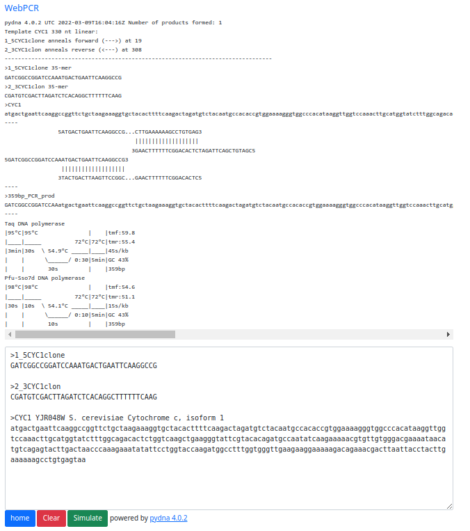
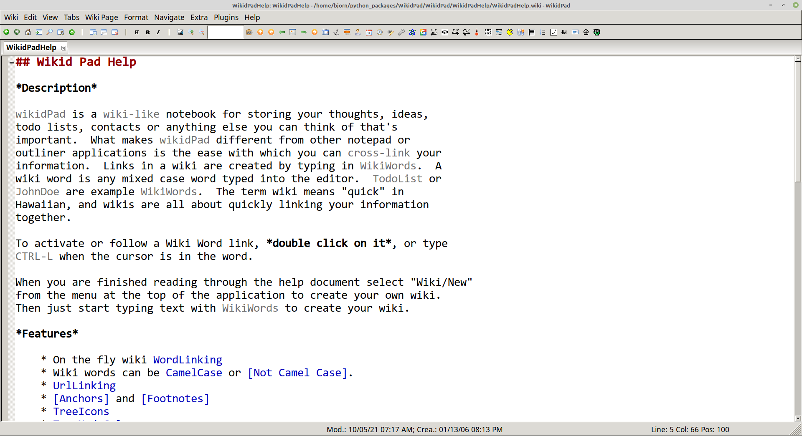

### pydna

Pydna is a python package that provide functions and classes to work with double stranded DNA.
See [Github repository](https://github.com/BjornFJohansson/pydna) for more information.

### seguid calculator

A point and click application to calculate the [SEGUID](http://www.ncbi.nlm.nih.gov/pubmed/16858731)
and [cSEGUID](http://ochsavidare.blogspot.pt/2016/02/checksum-for-circular-biological.html) checksums for
biological sequences such as DNA, RNA or proteins.  See [Github repository](https://github.com/BjornFJohansson/seguid_calculator)
for more information.

### WebPCR

[WebPCR](http://pydna.pythonanywhere.com/) is a PCR simulator that runs on the cloud service [PythonAnywhere](http://bjornfjohansson.pythonanywhere.com).
It can be used to simulate PCR, calculate melting temperatures and also design primers for a given sequence.

### mecplugins

is a collection of plugins for the for the personal wiki software [wikidPad](http://wikidpad.sourceforge.net/).

These plugins extends wikidPad with functions for molecular biology experiment design and electronic notebook keeping. See the videos below:

<iframe width="854" height="480" src="https://www.youtube.com/embed/TrhoIwiYYDU?ecver=1" frameborder="0" allowfullscreen></iframe>

<iframe width="854" height="480" src="https://www.youtube.com/embed/8zqKCJgP4so?ecver=1" frameborder="0" allowfullscreen></iframe>

<iframe width="854" height="480" src="https://www.youtube.com/embed/y5vkL9WgglY?ecver=1" frameborder="0" allowfullscreen></iframe>

<iframe width="854" height="480" src="https://www.youtube.com/embed/6pNSM2sU7_8?ecver=1" frameborder="0" allowfullscreen></iframe>

<iframe width="854" height="480" src="https://www.youtube.com/embed/ujMb2A3PJpE?ecver=1" frameborder="0" allowfullscreen></iframe>
